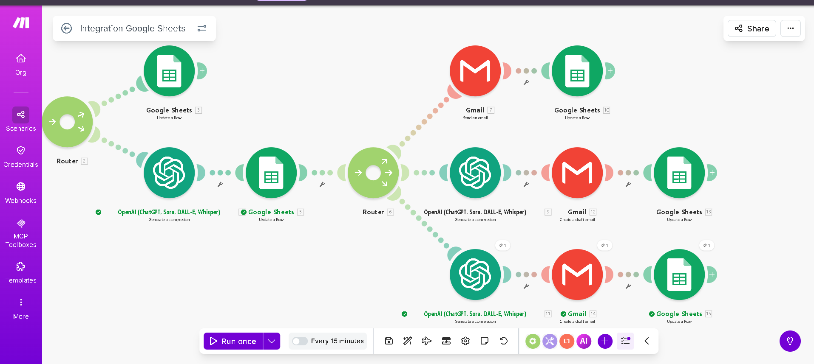

# AI-Customer-Feedback-Automation
AI-powered sentiment routing &amp; escalation workflow built with Make.com, OpenAI, Gmail, and Google Sheets.
 
## Problem

Manual customer support triage is slow, inconsistent, and prone to risk.  
Negative feedback can escalate quickly if mishandled, while positive feedback does not require human intervention.

Organizations need a scalable system that automates classification while preserving human oversight for high-risk cases.

---

## Solution Overview

This system automatically:

- Classifies customer feedback as Positive, Neutral, or Negative
- Routes responses based on sentiment
- Sends automated replies for low-risk cases
- Requires human review for medium-risk cases
- Flags and escalates high-risk cases
- Prevents AI from making unauthorized promises or commitments

The workflow balances automation efficiency with risk control.

---

## Architecture

 ## Workflow Architecture
 ## Workflow Architecture

---

## Routing Logic

### Positive
- AI generates response
- Email is automatically sent
- Status updated in Google Sheets

### Neutral
- AI generates response draft
- Gmail draft is created
- Human review required before sending

### Negative
- AI generates controlled response draft (no refunds or guarantees)
- Google Sheet row flagged as URGENT
- Internal alert sent to support team
- Human approval required before customer response
- Escalation triggered for legal or chargeback-related keywords

---

## Risk Mitigation and Safeguards

- Strict sentiment output constraints (single-word classification)
- Guardrails preventing refund, replacement, or timeline promises
- Keyword-based escalation detection
- Human-in-the-loop review for high-risk sentiment
- Status tracking and priority tagging within Google Sheets

---

## Technology Stack

- Make.com (workflow orchestration)
- OpenAI API (classification and response generation)
- Gmail API (email handling)
- Google Sheets API (tracking and escalation flags)

---

## Business Impact

- Reduces manual triage workload
- Improves response consistency
- Mitigates reputational and legal risk
- Enables scalable customer support operations
- Maintains oversight for high-risk interactions

---

## Demonstration

Make Scenario: (add link here)  
Video Walkthrough: (add link here)

---

## Future Enhancements

- Real-time Slack alert integration
- Sentiment analytics dashboard
- CRM integration
- Multi-language support
- Fine-tuned sentiment classification model
